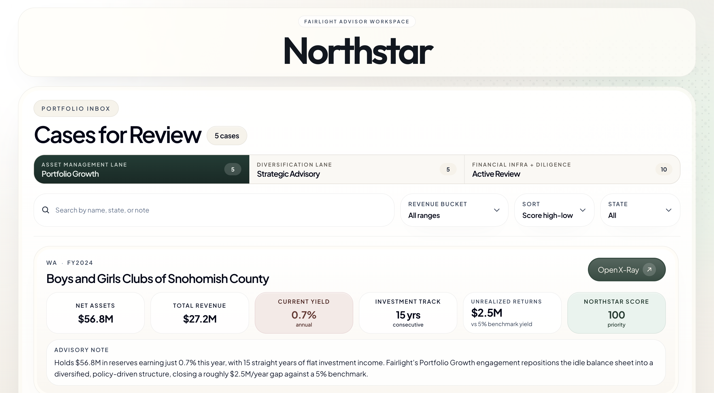
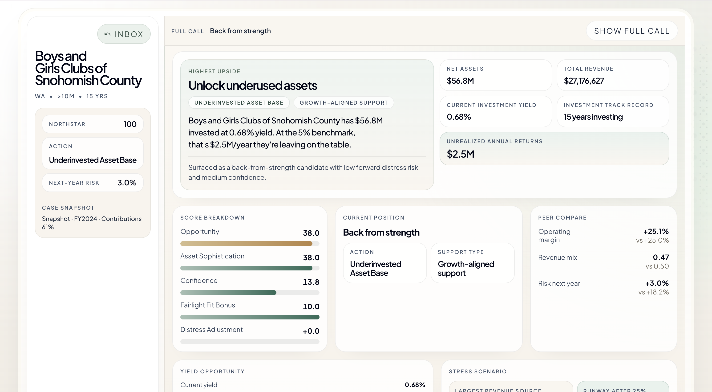
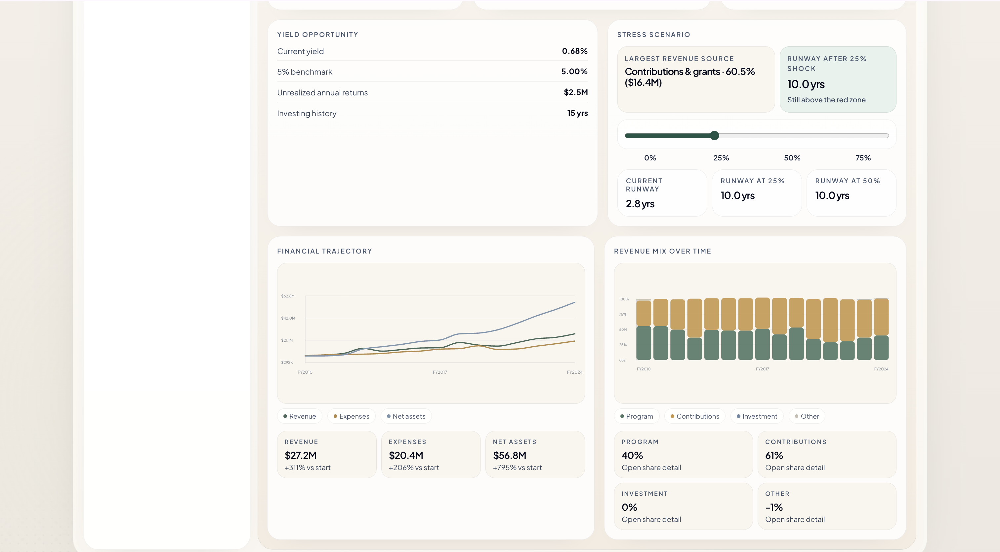
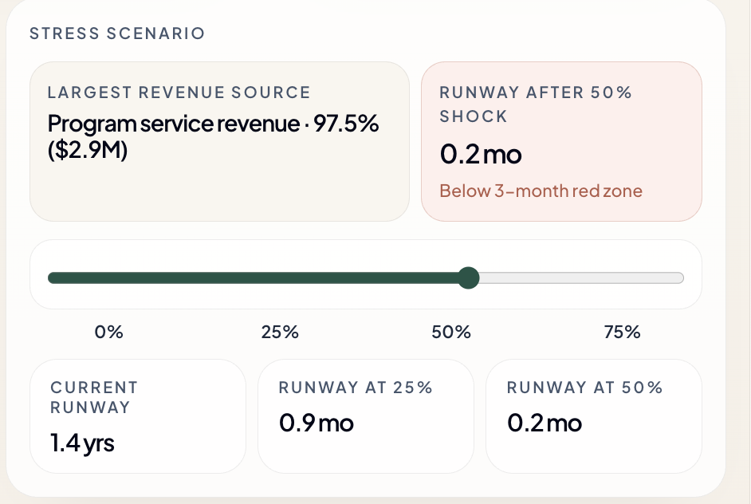
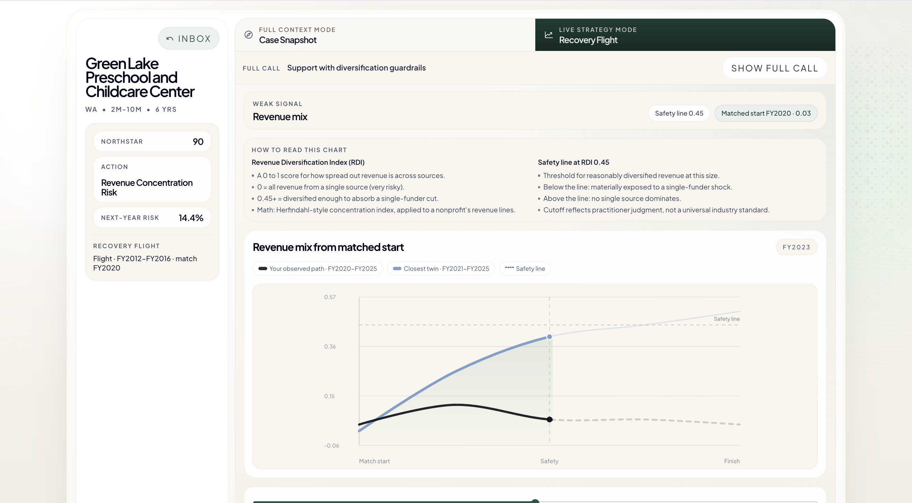
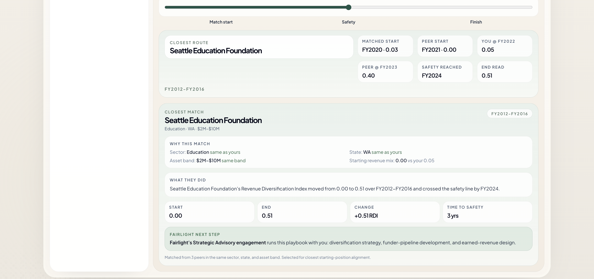
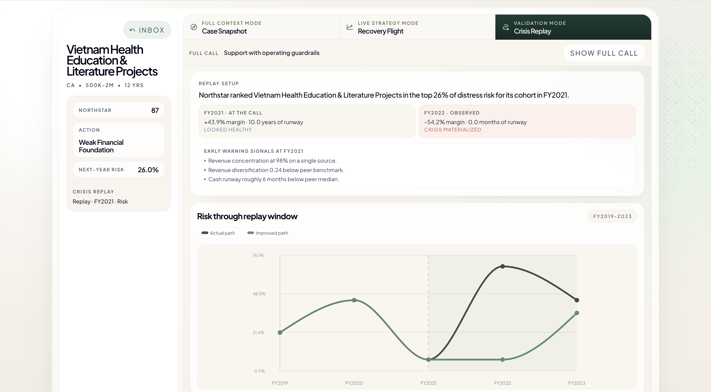
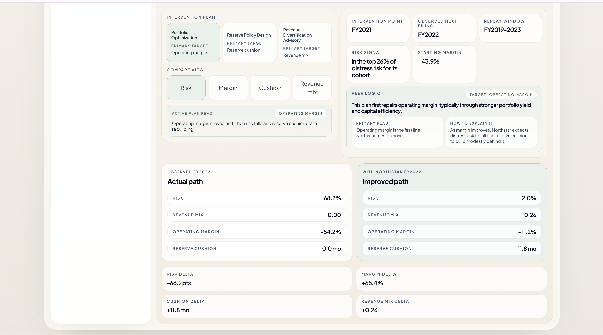

# Northstar — Fairlight Capital Stewardship Advisor

> A product that surfaces the nonprofits in California and Washington whose capital is
> underworking, whose revenue is dangerously concentrated, or whose runway is about to
> collapse — and tells a boutique-advisor what to do about each one.

Built at the **UC Davis MSBA Aggie Hackathon (April 12–14, 2026)** by the
*Real Housewives of Tenderloin* team: Saurav Kanegaonkar, Vedant Tiwari, and Amal Farhad Shaji.

---

## The problem

There are roughly 40,000 small-to-mid-sized nonprofits in California and Washington that
sit in the commercial blind spot between a financial advisor and an institutional
OCIO. They hold between $2M and $500M in net assets, they file a Form 990 every year
that discloses everything Wall Street would need, and yet nobody is working their
balance sheet. The result is a class of org that is:

- **Underinvested** — $56M sitting in cash earning 0.7% yield for 15 straight years
- **Concentrated** — $90M operation with 100% of revenue from a single state contract
- **Quietly fragile** — healthy-looking margins that collapse the moment a funder cuts
- **Under-documented** — filings so thin that the data itself becomes the risk

Fairlight is the boutique capital-stewardship advisor that would serve these orgs if
it existed. Northstar is the product that tells Fairlight where to call first.

---

## What Northstar does

Northstar ingests the full national Form 990 panel (3.8 million org-years from FY2007
through FY2026), filters to CA and WA, scores every organization against a
four-lane framework, and produces a ranked list of engagement candidates.

Every org in the ranked list carries a per-org X-Ray report that explains:

- What bucket the org falls into and why
- A stress test showing what happens when the largest revenue source gets cut
- A recovery-flight chart with a real peer who has walked the same trajectory back to safety
- For orgs flagged by our distress model, a Crisis Replay showing where the model
  correctly called the org before the crisis materialized, with SHAP-driven risk explanations



---

## The four Northstar buckets

Every CA+WA organization is assigned one of four action labels based on which
structural issue dominates its books:

| Bucket | One-line definition | Fairlight engagement |
|---|---|---|
| **Underinvested Asset Base (UAB)** | Holds real reserves, portfolio is passive | Portfolio Growth — build an investment policy, deploy idle capital |
| **Revenue Concentration Risk (RCR)** | Healthy margins, one funder holds every key | Strategic Advisory — diversify funding before a budget cycle forces it |
| **Weak Financial Foundation (WFF)** | Thin margins, shallow reserves, every shock lands hard | Financial Infrastructure — reserve policy, expense review, cash forecasting |
| **Needs Data Diligence (NDD)** | Missing filings fields, unclear signals | Diligence pass — reconcile the filings before any engagement |

---

## How each bucket is demonstrated in the app

### Portfolio Growth (UAB) — the opportunity lane

UAB organizations are healthy nonprofits whose balance sheets are asleep. The X-Ray
surfaces the yield gap, the consecutive-year investment track record, and the
implied unrealized return against a 5% benchmark.




### Strategic Advisory (RCR) — the risk lane

RCR orgs look fine until their largest funder changes anything. The Stress Test
slider moves a revenue shock from 0% to 75%; runway numbers recompute live,
and the card flips red when the result drops below three months.



### Recovery Flight — the proof-of-playbook visual

For every RCR and WFF org, the Recovery Flight chart overlays the org's observed
trajectory against a peer organization matched on sector, state, and asset band
that successfully walked the same metric back above the safety line.




### Crisis Replay — the credibility backbone

For ten WFF orgs in the curated dataset, Crisis Replay shows the org's state at
year T alongside the actual outcome at year T+1 or T+2. Every replay carries a
percentile-rank explanation, a two-year financial trajectory, and early-warning
signals derived from the org's own attributes at the call year.




---

## Methodology — how Northstar is scored

Northstar is a composite score on the 0–100 scale that combines:

- **Opportunity** (0–40) — asset base size capped at $50M plus yield gap vs 5% benchmark
- **Structural or bucket-aware middle component** (0–40) — different for each bucket:
  - RCR and NDD use a weighted stress/concentration blend
  - UAB uses an Asset Sophistication signal (asset scale, investment track record, yield gap depth)
  - WFF uses a Financial Foundation signal (asset-band fit, margin repair potential, low reserves, evidence strength)
- **Confidence** (0–20) — evidence quality plus data completeness
- **Fairlight Fit bonus** (0–10) — a commercial-fit multiplier for the boutique model
- **Distress penalty** (−15 to 0) — applied when next-year urgency probability exceeds defined thresholds

The final score is clamped to 0–100, then capped further by exclusion rules
(orgs above $500M in net assets are capped at 30 because they are outside
Fairlight's serviceable range; orgs below $500K non-RCR are capped at 40).

---

## The distress model

An XGBoost classifier predicts whether each organization will hit an urgency state
(cash runway below 3 months AND operating margin negative) in the following
fiscal year. The model is trained on a temporal holdout:

- **Training window:** FY2009 through FY2020 (2.2M org-years)
- **Test window:** FY2021 through FY2024 (693K org-years)
- **Base rate:** 18.2% of test-set org-years hit urgency

| Model | AUC | Precision | Recall | F1 | Interpretability |
|---|---|---|---|---|---|
| Logistic regression (baseline) | 0.65 | 0.27 | 0.55 | 0.36 | Coefficients |
| **Logistic regression (expanded features)** | **0.71** | **0.42** | 0.37 | 0.39 | Coefficients |
| XGBoost (baseline) | 0.85 | 0.44 | 0.75 | 0.56 | SHAP |
| **XGBoost (expanded features)** | **0.85** | **0.44** | **0.75** | **0.56** | **SHAP** |

The UI ships XGBoost for ranking accuracy with SHAP-style explanations, with
logistic regression coefficients available for board-facing advisory memos
where coefficient interpretability matters more than the AUC delta.

---

## The D1–D5 deliverables

The backend work is organized into five sequential deliverables:

| Phase | Output |
|---|---|
| **D1** | Panel build — 3.8M org-years from raw Form 990 filings, FY2007–FY2026 |
| **D2** | Cohort benchmarking — per-sector, per-size benchmarks with stress test fields |
| **D3** | Two-lane shortlist — 575 Lane 1 (UAB) and Lane 2 (RCR) Fairlight-serviceable targets |
| **D4** | Per-org stress-test computation and demo case curation |
| **D5 / D5.1** | Temporal-holdout validation, expanded feature set, XGBoost + SHAP, Crisis Replay shortlist |

The frontend ships a hand-picked **20-org demo dataset** — 5 UAB + 5 RCR + 9 WFF + 1 NDD —
where every org has Stress Test, Recovery Flight (for RCR and WFF), and Crisis Replay
(for WFF) content attached.

---

## Tech stack

**Frontend**
- React 19 + TypeScript + Vite 6
- TailwindCSS 4 for styling
- d3 for Recovery Flight and Crisis Replay charts
- Framer Motion for transitions
- Vitest for unit tests

**Backend / Analysis**
- Python 3.12+, pandas, numpy
- scikit-learn (logistic regression, preprocessing pipelines)
- XGBoost (distress model)
- SHAP (model explainability)
- Apache Parquet (panel and intermediate outputs)
- Joblib (model persistence)

**Infrastructure**
- Git + GitHub for version control
- Vercel for production hosting of the advisor app

---

## Repository structure

```
├── analysis/                        # Python exporters producing the frontend JSON
│   ├── export_fairlight_advisor_dataset.py
│   └── export_demo_dataset.py       # 20-org demo exporter
├── scoring/                         # Distress model + D5/D5.1 validation scripts
│   ├── stage4_distress_model.py
│   ├── d5_temporal_validation.py
│   ├── d5_curate_replay_cases.py
│   └── d5_1_expanded_models.py
├── fairlight-advisor/               # React frontend
│   ├── src/
│   │   ├── App.tsx
│   │   ├── components/
│   │   │   ├── PortfolioInbox.tsx
│   │   │   ├── OrganizationCard.tsx      # Bucket-aware metric cards
│   │   │   └── DecisionLab.tsx           # X-Ray with Snapshot / Recovery Flight / Crisis Replay
│   │   ├── data/fairlight-advisor.json   # 20-org demo dataset
│   │   └── lib/advisorLanguage.ts        # Northstar Score + advisory notes
│   └── package.json
├── outputs/                         # Generated artifacts (parquet files gitignored)
│   ├── stage3/
│   ├── stage4/
│   ├── d5_validation/
│   └── d5_1_validation/
└── docs/                            # Specs, contracts, design docs
    └── screenshots/                 # README images
```

---

## Running locally

### Prerequisites

- Node.js 20+
- Python 3.12+ (3.14 tested)
- Python packages: pandas, numpy, scikit-learn, xgboost, shap, joblib

### Start the advisor app

```bash
cd fairlight-advisor
npm install
npm run dev
```

The app runs at `http://localhost:5173`.

### Regenerate the 20-org demo dataset

```bash
python3 analysis/export_demo_dataset.py
```

This reads the raw panel, re-scores every org with the D5.1 XGBoost model, attaches
Crisis Replay payloads, generates peer analogs, and writes the frontend JSON in one pass.

### Run the test suite

```bash
# Python tests
python3 -m pytest tests/ --ignore=tests/test_stage4_distress_model.py

# TypeScript tests
cd fairlight-advisor && npx vitest run
```

---

## Honest methodology notes

- **Revenue Diversification Index (RDI)** is a Simpson-Diversity transformation of
  the Herfindahl concentration index — standard math with a "higher is better"
  orientation that matches the rest of the UI.
- **Safety thresholds** (RDI 0.45, runway 6 months, margin 0%) reflect practitioner
  judgment rather than industry-standard cutoffs. They are calibrations, not
  universal norms.
- **Distress probabilities** are rank-reliable but not perfectly calibrated. Displayed
  percentile rankings (e.g. "top 3% of cohort") are more trustworthy than absolute
  probability values.

---

## Team

- **Saurav Kanegaonkar** — product, data pipeline, scoring, deck
- **Vedant Tiwari** — data pipeline, model validation
- **Amal Farhad Shaji** — frontend, decision lab, visual design

Built in 48 hours for the **UC Davis MSBA Aggie Hackathon 2026**.

---

## Related documentation

- [Onboarding](docs/onboarding.md) — setup and workflow for contributors
- [System architecture](docs/collab-system-design.md) — how the collab orchestration works
- [Pre-merge checklist](docs/merge_checklist.md) — what to check before merging
